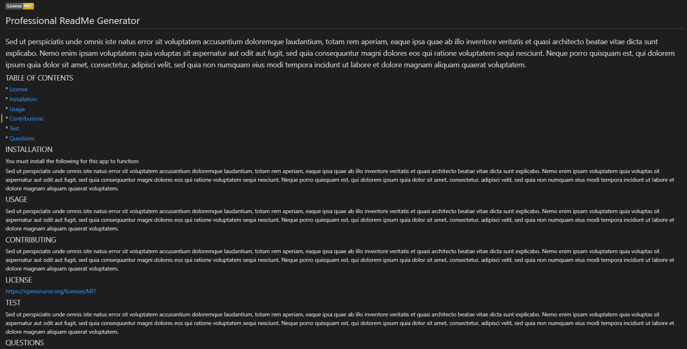

# readme-generator
You can quickly and easily generate a README file by using a command-line application to generate one. 

## Challenge Goal
To create a command-line application that dynamically generates a professional README.md file from a user's input using the Inquirer package

## Technologies
- Node.js

## Challenge Screenshot

## Deployment
https://christiandc19.github.io/readme-generator/

https://github.com/christiandc19/readme-generator/

